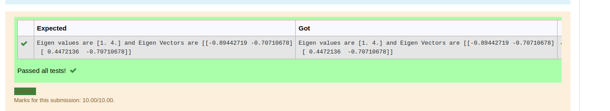

# EIGENVALUES-AND-EIGENVECTORS
## Aim:
To write a python program to find the Eigenvalues and Eigen Vectors
## Equipment’s required:
1. 	Hardware – PCs
2. 	Anaconda – Python 3.7 Installation / Moodle-Code Runner
## Algorithm:
### Step1 : 
importing the function , import numpy as np

### Step 2: 
taking input by using ,np.array([])

### Step 3: 
Using the np.linalg.eig(),  we get two results (first is eigenvalue and second is eigenvector) of the given matrix.

### Step 4: 
then print eigen value and vector by using format 

## Program:
``` python
#Program to find the eigen values and eigen vectors.
#Developed by: SASIRAJKUMAR T J
#RegisterNumber:22005240
import numpy as np
A = np.array([[2,2],[1,3]])
values,vector=np.linalg.eig(A)
print("Eigen values are {} and Eigen Vectors are {}".format(values,vector))
```

## Output:

## Result:
Thus the Eigenvalue and Eigenvector is successfully solved using python program
